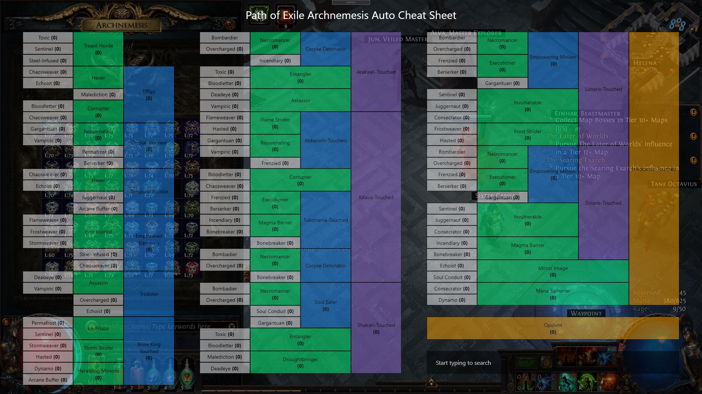

#  Path of Exile Archnemesis Auto Cheat Sheet (ACS)

## ACS Showcase 

| OpenCV Identifying | Before Match | After Match |
| :---: | :---: | :---: |
|| | |

 

### Video Showcase

 

## Download Link

- Still in development (v0.1.3)

 

## Miscellaneous

### Acknowledgement:

- [OpenCV 4.0](https://opencv.org/opencv-4-0/)
- [FontAwesome](https://fontawesome.com/)
- [HardCodet's NotifyIcon](http://www.hardcodet.net/wpf-notifyicon)
- [u/btz_exhausted's Archnemesis Cheat Sheet](https://www.reddit.com/r/pathofexile/comments/smvzgw/archnemesis_recipes_and_rewards_cheat_sheet/)

### Updates Incoming (as of 12/02/22):

- Working on procuring more mods
    - Mods without braces are not implemented yet; templates from wiki didn't work
- Working search function
    - Waiting to procure all available mods to start working on search, works by typing in the overlay and darkening non-searched mods
- Changeable hotkeys
    - As of now, **CTRL + SHIFT + A** to show/hide the overlay and **CTRL + SHIFT + S** to scan + show/hide the overlay
- Working on System Tray menu
    - Only an icon of the tool is in the overlay with the name as it's tooltip without any menu to exit etc.
- Addition of tooltip
    - The tooltip for each Archnemesis mod will show its rewards and its reward(s) modifiers if there are any 
- Design of Cheatsheet
    - No icons are in the cheatsheet as T1 mods (and some T2s) will not have space, will be looking for ideas so do suggest

### Q&A:

- Can you get banned from using this tool?
    - This tool is not against the ToS as it doesn't interfere with any of the Path of Exile official files, let alone the application, nor does it perform multiple actions per key press. Down to its very core, it is simply a screenshot tool that is able to identify and count the number of mods based on a template that was manually procured and cropped.
- How do I use the tool?
    - Until the ability to change hotkeys are added, the basic control is **CTRL + SHIFT + A** to show/hide overlay and **CTRL + SHIFT + S** to scan + show/hide the overlay. 
- Why doesn't my Archnemesis Mods get counted towards the scan?
    - Due to the icon of the mods being so similar, a very high threshold is used to distinguish each mod. As a result of this high threshold, the difference of a few pixel, between the template that is currently in the tool and what appears from your screen, albeit small may result in the tool as not recognizing the said mod.
    - You may raise an "Issue" via GitHub, and I will review and add the template to the programme for it to be "recognizable".
- How do I read the cheat sheet?
    - White, Green, Blue, Purple and Orange are T1, T2, T3, T4 and T5 mods respectively. To make Treant Horde (T2), you'll need to combine the Toxic (T1), Sentinel (T1) and Steel-infused (T1). By this system, you'll need 24 T1-mods to create Innocence-touched (T5).
